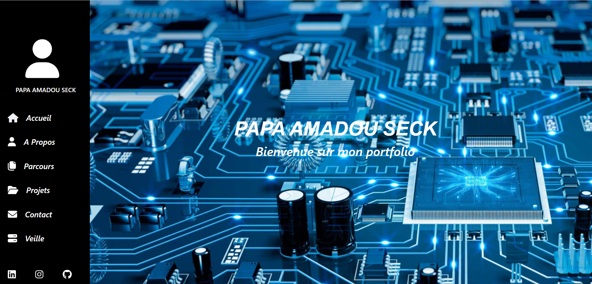

# 💼 Portfolio Personnel - Seck

Ce projet est un portfolio personnel réalisé dans le cadre de la formation **BTS SIO (SLAM)** au **Campus Mewo**.  
Il a pour but de présenter mes compétences, mes projets, ainsi qu’un formulaire de contact fonctionnel permettant aux visiteurs de me joindre facilement.

---

## 🛠️ Technologies utilisées

- **HTML5**
- **CSS3**
- **JavaScript**
- **PHP** (pour le traitement du formulaire de contact)
- **Bootstrap** (framework CSS pour la mise en page responsive)
- **FontAwesome** (icônes vectorielles)
- **Infomaniak** (hébergement)
- **Nom de domaine :** [seck-papa.fr](https://seck-papa.fr)

---

## 📂 Fonctionnalités

- Présentation claire de mes projets et de mes compétences
- Design responsive adapté aux ordinateurs, tablettes et smartphones
- Formulaire de contact fonctionnel (nom, e-mail, message)
- Envoi sécurisé des messages via **PHP**
- Affichage des erreurs en cas de formulaire mal rempli

---

## 📸 Aperçu



---

## 🚀 Lancer le projet en local

1. Cloner le dépôt :
   ```bash
   git clone https://github.com/seck024/portfolio
   cd portfolio
   ```
2. Ouvrir le dossier dans un éditeur de code (ex : VS Code)

3. Démarrer un serveur local (ex : avec XAMPP, Laragon, etc.)

4. Accéder au site depuis `http://localhost/portfolio`

---

## 🔒 Sécurité

Le formulaire intègre une validation côté client et côté serveur :
- Vérification des champs requis
- Validation du format de l’e-mail
- Protection contre les injections simples

---

## 📬 Contact

Vous pouvez me contacter via le formulaire sur le site, ou directement à l'adresse indiquée sur la page "Contact".

---

## 📃 Licence

Ce projet est en accès libre pour inspiration ou apprentissage, mais ne peut pas être copié tel quel à des fins commerciales ou d'évaluation sans mon autorisation.
